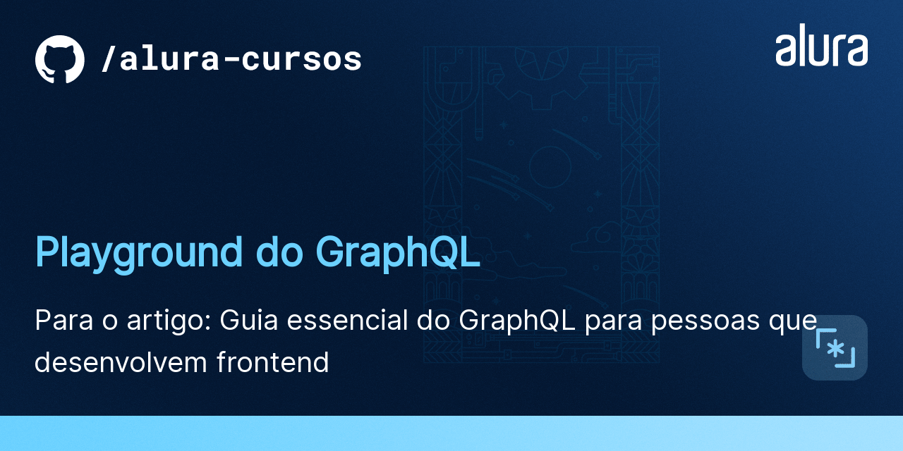
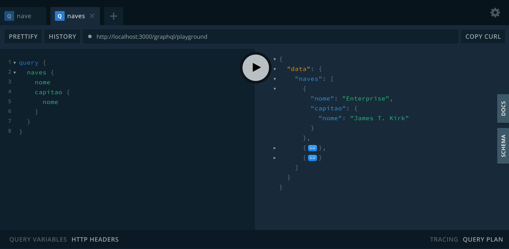

# GraphQL

Esse é um playground de exemplo para que você possa realizar suas primeiras queries




## 🛠️ Instalação

```bash
$ npm install
```

## 🛠️ Execução

Abra um terminal e execute o seguinte comando:

```bash
$ npm run start
```

Agora sim, tudo pronto para começar!

